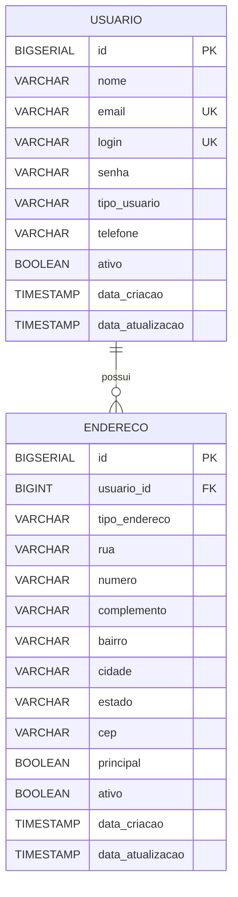

# Modelagem de Dados

## Entidades e relacionamentos

## Regras do modelo

- `usuario` possui relacionamento `1:N` com `endereco`.
- `email` e `login` são únicos.
- Cada usuário deve possuir ao menos um endereço.
- Exatamente um endereço ativo deve estar marcado como principal.
- A exclusão de `usuario` remove seus `enderecos` por `ON DELETE CASCADE`.

## Estrutura das tabelas

### `usuario`

| Coluna | Tipo | Restrição |
| --- | --- | --- |
| `id` | `BIGSERIAL` | PK |
| `nome` | `VARCHAR(100)` | `NOT NULL` |
| `email` | `VARCHAR(100)` | `NOT NULL`, `UNIQUE` |
| `login` | `VARCHAR(50)` | `NOT NULL`, `UNIQUE` |
| `senha` | `VARCHAR(255)` | `NOT NULL` |
| `tipo_usuario` | `VARCHAR(20)` | `NOT NULL`, `CHECK` |
| `telefone` | `VARCHAR(20)` | opcional |
| `ativo` | `BOOLEAN` | `NOT NULL`, default `TRUE` |
| `data_criacao` | `TIMESTAMP` | `NOT NULL`, default `CURRENT_TIMESTAMP` |
| `data_atualizacao` | `TIMESTAMP` | `NOT NULL`, default `CURRENT_TIMESTAMP` |

### `endereco`

| Coluna | Tipo | Restrição |
| --- | --- | --- |
| `id` | `BIGSERIAL` | PK |
| `usuario_id` | `BIGINT` | `NOT NULL`, FK `usuario(id)` |
| `tipo_endereco` | `VARCHAR(20)` | `NOT NULL`, default `RESIDENCIAL` |
| `rua` | `VARCHAR(255)` | `NOT NULL` |
| `numero` | `VARCHAR(20)` | opcional |
| `complemento` | `VARCHAR(100)` | opcional |
| `bairro` | `VARCHAR(100)` | opcional |
| `cidade` | `VARCHAR(100)` | `NOT NULL` |
| `estado` | `VARCHAR(2)` | opcional, `CHECK` |
| `cep` | `VARCHAR(10)` | `NOT NULL`, `CHECK` |
| `principal` | `BOOLEAN` | `NOT NULL`, default `TRUE` |
| `ativo` | `BOOLEAN` | `NOT NULL`, default `TRUE` |
| `data_criacao` | `TIMESTAMP` | `NOT NULL`, default `CURRENT_TIMESTAMP` |
| `data_atualizacao` | `TIMESTAMP` | `NOT NULL`, default `CURRENT_TIMESTAMP` |

## Índices e suporte operacional

- `usuario`: índices em `email`, `login`, `tipo_usuario`, `ativo`, `data_criacao`.
- `endereco`: índices em `usuario_id`, `cep`, `cidade`, `estado`, `principal`, `tipo_endereco`, `ativo`.
- Triggers atualizam `data_atualizacao` automaticamente nas duas tabelas.
- A definição física está versionada em [V1__create_initial_schema.sql](../src/main/resources/db/migration/V1__create_initial_schema.sql).
